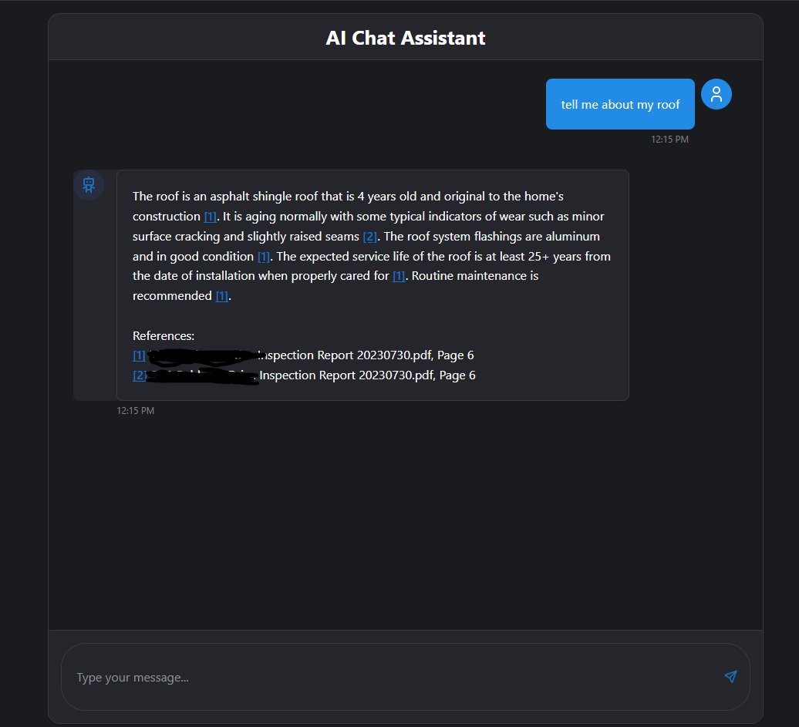

# Simple RAG Chatbot

A modern, responsive chatbot application that uses Retrieval-Augmented Generation (RAG) to provide accurate, context-aware responses based on your PDF documents. Built with Google's Gemini AI, ChromaDB, and a React + Flask stack.

## Features

- 📄 PDF Document Processing: Upload and process PDF documents for contextual information
- 🔍 Smart Retrieval: Uses ChromaDB vector store for efficient semantic search
- 🤖 Advanced AI Responses: Powered by Google's Gemini AI model
- 💬 Real-time Chat Interface: Modern React-based UI with streaming responses
- 📚 Source Citations: Automatic citation of sources with page numbers
- 🎯 Context-Aware: Responses are based on your document content

## Architecture

### Backend Components

- **Flask Server**: REST API handling document processing and chat endpoints
- **Document Processor**: Manages PDF processing and vector storage
- **Gemini AI**: Google's latest LLM for generating responses
- **ChromaDB**: Vector database for efficient semantic search
- **LangChain**: Framework for connecting various components

### Frontend Components

- **React + TypeScript**: Modern frontend framework
- **Real-time Updates**: Server-Sent Events for streaming responses
- **Responsive Design**: Modern UI that works on all devices

## Setup Instructions

### Prerequisites

- Python 3.8+
- Node.js 16+
- Google Cloud API key with Gemini API access
